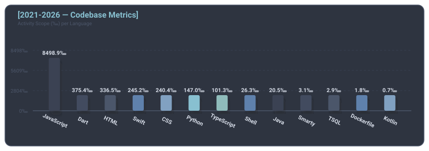
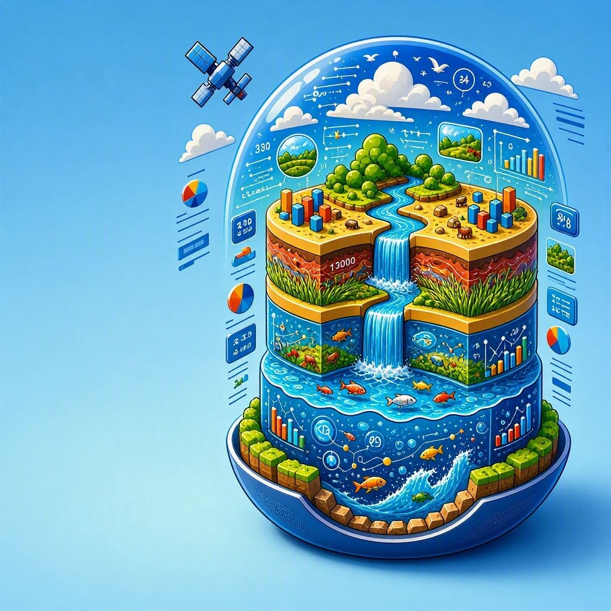

  
  
  <!--
    
  -->
  
  
    

  <a href="README.md">English</a> | <a href="README_zh.md"> 中文</a> | <a href="README_hi.md"> हिन्दी</a> | <a href="README_es.md"> Español</a> | <a href="README_ar.md"> العربية</a> | <b>Français</b>

📜 Conférences sur les logiciels, l'open source et le machine learning 
📜 Certificats, hackathons mondiaux menés par des étudiants 
   Hackathons, IBM Dev Days, GDGoC Dev-Sprint 
📜 Examens, Microsoft GitHub Foundations, Java Serverless 
📜 Cours d'informatique des universités américaines 
📜 Diplôme de premier cycle (Licence), Linguistique 
📜 Diplômes d'études supérieures / de cycle supérieur (2020-présent), Génie logiciel (Ingénierie, Informatique (2023-présent)) 
📜 Cours universitaires américains en génie logiciel / informatique (printemps-automne 2026) 

---

     
  
  
    
    
    
  
    
  

 
  
  </a>  
  
    
     
     
     
  
  

   
  
  
   
      
    
   
   
  
   

     
   
     
    
   
   
   
    
   
  
  
  

    
         
    

  
  
  

   

    

<table>
  <tr>
    <td width="20%" align="center">

      </td>
    <td width="30%" align="center">

    </td>
        <td width="20%" align="center">

      </td>
    <td width="30%" align="center">

    </td>
  </tr>
</table>
<table>
    <tr>
    <td width="15%" align="center">

    </td>
    <td width="27.5%" align="center">

    </td>
        <td width="15%" align="center">

    </td>
        <td width="27.5%" align="center">

    </td>
        <td width="15%" align="center">

    </td>
  </tr>
</table>

|  |  |  |
|:--|:--|:--|
|  |   |  |
|  |  |  |
|  |    |  |
|  |  |  |
|  |  <!----> |  |
|  |  |  |

<table>
    <tr>
    <td width="40%" align="center">
  
      </td>
    <td width="60%" align="center">
  
    </td>
  </tr>
</table>
<table>
  <tr>
    <td width="20%" align="center">

  
fiction-multiserveur™

      </td>
    <td width="30%" align="center">

  
emploi-du-temps-adhésif™

    </td>
        <td width="20%" align="center">

  
appareils-de-mesure™

      </td>
    <td width="30%" align="center">

  
livraison-de-marchandises®

    </td>
  </tr>
</table>
<table>
    <tr>
    <td width="15%" align="center">

  
analyseur-de-statistiques™

    </td>
    <td width="27.5%" align="center">

  
stock-animé™

    </td>
        <td width="15%" align="center">

  
sous-sections-de-saas™

    </td>
        <td width="27.5%" align="center">

  
pépites-de-voyage™

    </td>
        <td width="15%" align="center">

  
poignées-de-meubles™

    </td>
  </tr>
</table>